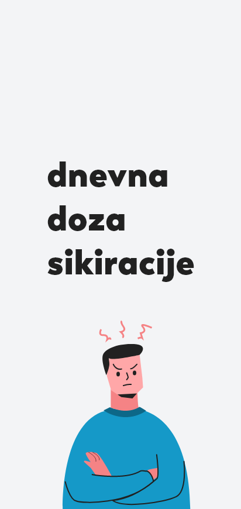
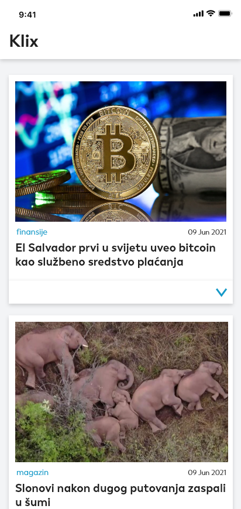
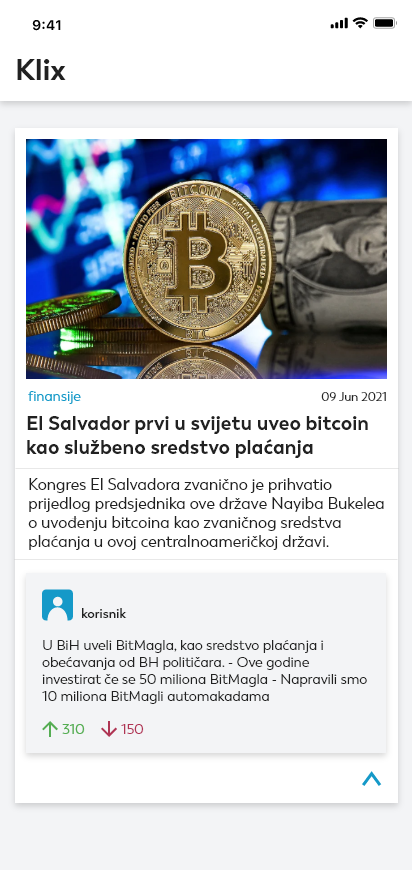

# DnevnaDozaSikiracije
Android app that reads the rss feed of the klix.ba website and presents the articles in a simple UI with top comments that are bound to evoke some feelings in the user.

-------------
  

&ensp;

&ensp;

## Library
* [Volley](https://github.com/google/volley)
* [Glide](https://github.com/bumptech/glide)

## RSS
* [Klix](https://klix.ba/rss)

## Architecture
* Java
* XmlPullParser
* MVP - Model View Presenter
* Room

## Design
* Adobe Xd

## Developed and Designed By
Abdulmedžid Pehlić

